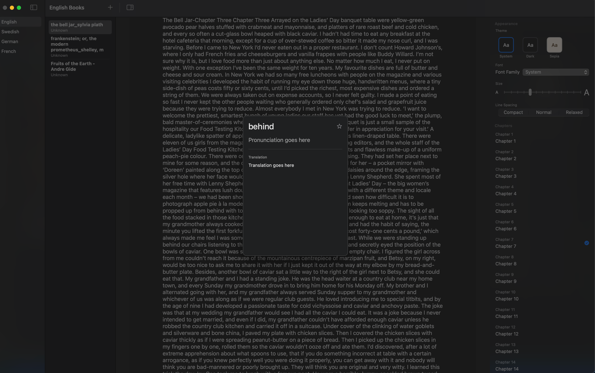

# NaturalFlow

"To learn a language is to read a book." - A book reader designed for language learning on macOS. Built with SwiftUI and modern Apple technologies, NaturalFlow offers an elegant reading experience with integrated language learning features.

## Features

- 📚 Clean, distraction-free EPUB reading interface
- 🔍 Single-click word translation and lookup
- 📝 Personal vocabulary learning list
- 🎨 Multiple reading themes (Light, Dark, Sepia)
- ⚙️ Customizable typography settings
- 📖 Chapter navigation and progress tracking
- 🗂 Multi-language book library organization
- 🔄 Drag and drop book import

## System Requirements

- macOS 14.0 (Sonoma) or later
- Apple Silicon Mac (M1 or later) recommended
- Minimum 8GB RAM recommended
- At least 256MB free storage space

## Development Environment

- macOS Sonoma 14.6.1 (arm64)
- Xcode 15.0 or later
- Swift 5.9 or later
- SwiftData for persistence
- ZIPFoundation for EPUB handling

## Installation

1. Clone the repository:

```bash
git clone https://github.com/yourusername/NaturalFlow.git
```

2. Open the project in Xcode:

```bash
cd NaturalFlow
open NaturalFlow.xcodeproj
```

3. Build and run using Xcode (⌘R)

## Architecture

- **SwiftUI** for modern declarative UI
- **SwiftData** for persistent storage
- **Combine** for reactive programming
- **ZIPFoundation** for EPUB file handling
- **PDFKit** for PDF support (coming soon)

## Project Structure

```
NaturalFlow/
├── Models/         # Data models and structures
├── Views/          # SwiftUI views
├── Managers/       # Business logic and services
├── Helpers/        # Utility functions and extensions
└── Resources/      # Assets and configuration files
```

## Features in Development

- [ ] PDF support
- [ ] Integration with translation APIs
- [ ] Spaced repetition for vocabulary learning
- [ ] Reading statistics and progress tracking
- [ ] Cloud sync for reading progress and vocabulary
- [ ] Advanced text analysis tools

## Contributing

1. Fork the repository
2. Create your feature branch (`git checkout -b feature/AmazingFeature`)
3. Commit your changes (`git commit -m 'Add some AmazingFeature'`)
4. Push to the branch (`git push origin feature/AmazingFeature`)
5. Open a Pull Request

## License

This project is licensed under the MIT License - see the [LICENSE](LICENSE) file for details.

## Acknowledgments

- SwiftUI and Apple's development frameworks
- [ZIPFoundation](https://github.com/weichsel/ZIPFoundation) for EPUB handling
- The Swift community for inspiration and support

## Screenshots


